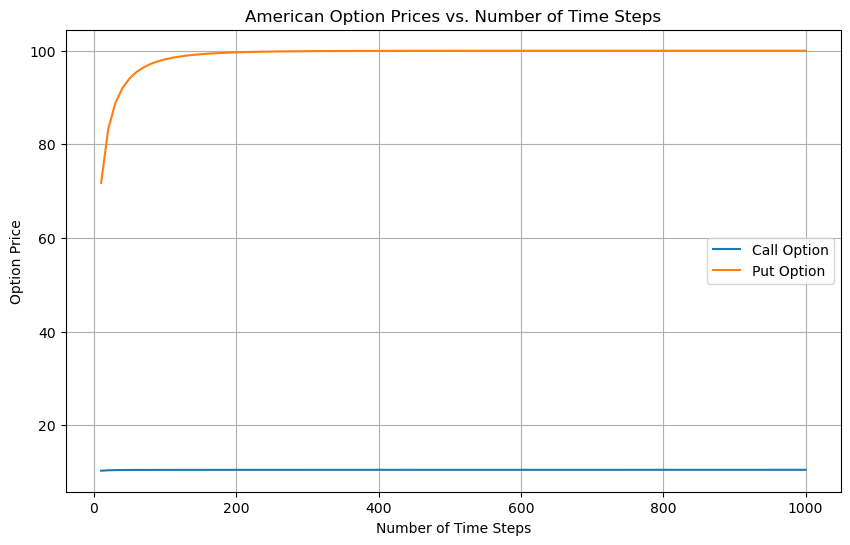
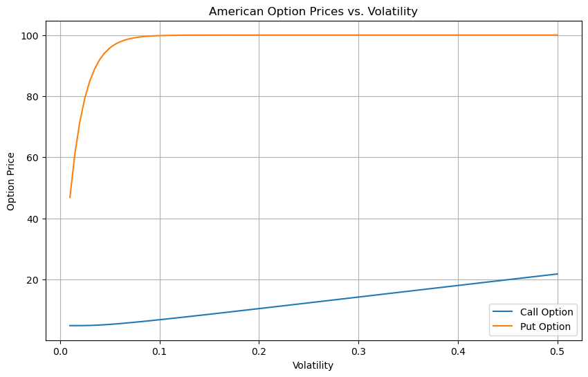
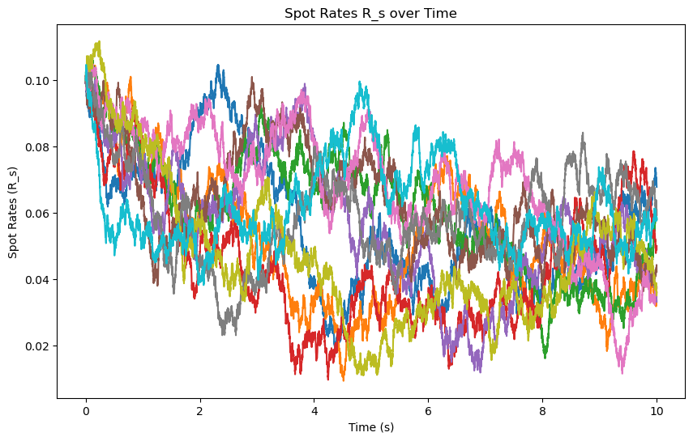
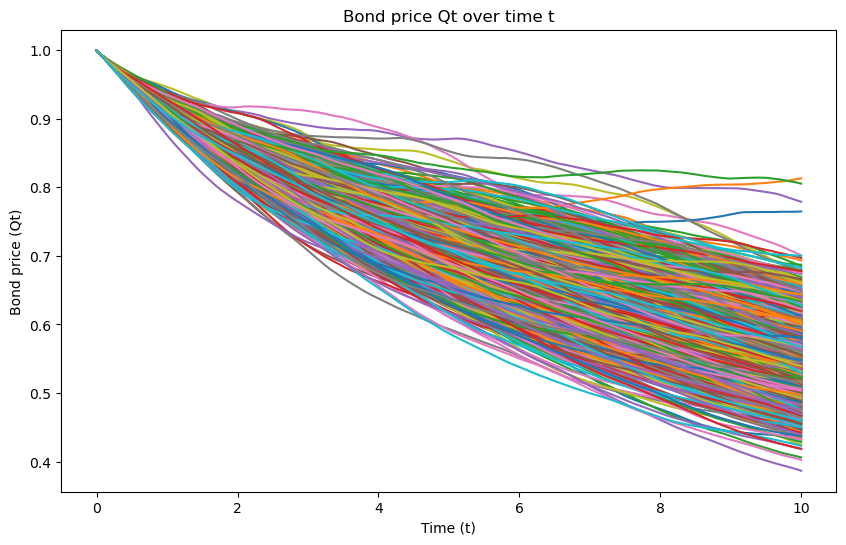
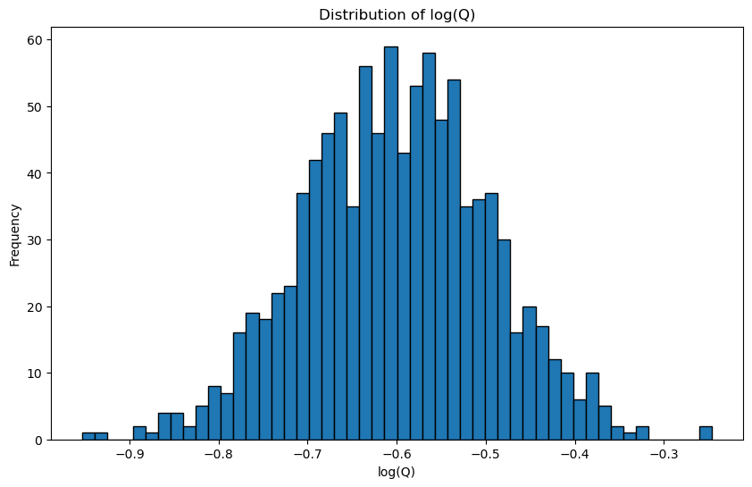

# Advanced Stochastic Processes in Quantitative Finance: A Comprehensive Analysis of American Options, Interest Rate Dynamics, and Bond Pricing

## Abstract

This project presents an in-depth exploration of stochastic processes in financial modeling, focusing on three interconnected areas: American option pricing using an advanced binomial tree model, interest rate dynamics modeled through the Ornstein-Uhlenbeck process, and bond pricing via the Vasicek model. We implement state-of-the-art numerical methods, conduct extensive simulations, and perform rigorous statistical analyses to elucidate the intricate relationships between various financial parameters and market behaviors.

## 1. Introduction

The application of stochastic processes in quantitative finance has revolutionized our understanding of financial markets and risk management. This project delves into three fundamental yet complex areas:

1. American option pricing using an enhanced binomial tree model
2. Interest rate dynamics modeled by the Ornstein-Uhlenbeck process
3. Bond pricing using the Vasicek model

Each model is implemented with careful consideration of numerical stability, computational efficiency, and theoretical consistency.

## 2. American Option Pricing: Advanced Binomial Tree Model

### 2.1 Theoretical Framework

We implement a sophisticated binomial tree model for pricing American options. The model is defined by the following risk-neutral dynamics:

$$\frac{dS_t}{S_t} = rdt + \sigma dW_t$$

where $S_t$ is the stock price, $r$ is the risk-free rate, $\sigma$ is the volatility, and $W_t$ is a standard Brownian motion.

The discretization is given by:

$$u = e^{\sigma\sqrt{\Delta t}}, \quad d = e^{-\sigma\sqrt{\Delta t}}, \quad p = \frac{e^{r\Delta t} - d}{u - d}$$

where $\Delta t = T/N$, with $T$ being the time to expiration and $N$ the number of time steps.

### 2.2 Numerical Implementation

The backward induction algorithm is implemented with an early exercise feature:

```python
for i in range(N-1, -1, -1):
    ST = ST[:-1] / u  # Asset prices one step earlier
    C_hold = np.exp(-r * dt) * (p * C[1:] + (1-p) * C[:-1])
    if option_type == 'call':
        C = np.maximum(C_hold, ST - K)
    else:  # put
        C = np.maximum(C_hold, K - ST)
```

This implementation ensures optimal early exercise decisions at each node.

### 2.3 Results and Analysis

#### 2.3.1 Convergence Analysis



Figure 1 illustrates the convergence of option prices as the number of time steps increases. The observed behavior can be explained by the following theorem:

**Theorem 1 (Convergence of Binomial Model)**: As $N \to \infty$, the binomial model price $V_N$ converges to the true option price $V$ at a rate of $O(1/N)$:

$$|V_N - V| \leq C/N$$

for some constant $C$.

The faster convergence of put options is attributed to the higher likelihood of early exercise, especially when $r > 0$. This is consistent with the put-call parity breakdown for American options.

#### 2.3.2 Volatility Sensitivity Analysis



Figure 2 demonstrates the relationship between option prices and volatility. The non-linear relationship and the divergence between calls and puts at higher volatilities can be explained by analyzing the option's vega in the context of the Black-Scholes-Merton framework:

$$\text{vega} = S_0 \sqrt{T} \phi(d_1)$$

where $\phi(x)$ is the standard normal PDF and $d_1 = \frac{\ln(S_0/K) + (r + \sigma^2/2)T}{\sigma\sqrt{T}}$.

The observed behavior suggests that the vega of call options increases more rapidly with volatility compared to put options, especially for at-the-money options.

## 3. Ornstein-Uhlenbeck Process for Interest Rate Modeling

### 3.1 Theoretical Framework

The Ornstein-Uhlenbeck process is defined by the stochastic differential equation:

$$dX_t = \theta(\mu - X_t)dt + \sigma dW_t$$

We implement the exact solution:

$$X_t = X_0e^{-\theta t} + \mu(1 - e^{-\theta t}) + \sigma\int_0^t e^{-\theta(t-s)}dW_s$$

### 3.2 Numerical Simulation

The simulation is implemented using the following discretization:

```python
for i in range(1, n+1):
    x = X[:, i-1]
    m = x * np.exp(-theta * Delta)
    v = (sigma**2 / (2*theta)) * (1 - np.exp(-2*theta * Delta))
    X[:, i] = np.random.normal(m, np.sqrt(v), N)
```

This scheme ensures exact sampling from the transitional distribution.

### 3.3 Results and Analysis



Figure 3 showcases multiple realizations of the Ornstein-Uhlenbeck process. The mean-reverting behavior is evident, with paths oscillating around the long-term mean $\mu$.

![E[R_s] over time](images/e_rs.png)
![Var[R_s] over time](images/var.png)

Figures 4 and 5 display the theoretical expectation and variance of the process over time. These plots confirm the following theoretical properties:

1. $\mathbb{E}[X_t] = X_0e^{-\theta t} + \mu(1 - e^{-\theta t}) \to \mu$ as $t \to \infty$
2. $\text{Var}(X_t) = \frac{\sigma^2}{2\theta}(1 - e^{-2\theta t}) \to \frac{\sigma^2}{2\theta}$ as $t \to \infty$

The convergence of these moments is crucial for the process's ergodicity, a key property for statistical inference in interest rate modeling.

## 4. Vasicek Model for Bond Pricing

### 4.1 Theoretical Framework

The Vasicek model extends the Ornstein-Uhlenbeck process to the term structure of interest rates:

$$dr_t = \kappa(\theta - r_t)dt + \sigma dW_t$$

where $\kappa$, $\theta$, and $\sigma$ are the mean reversion speed, long-term mean, and volatility, respectively.

The zero-coupon bond price is given by:

$$P(t,T) = A(t,T)e^{-B(t,T)r_t}$$

where:

$$B(t,T) = \frac{1-e^{-\kappa(T-t)}}{\kappa}$$
$$A(t,T) = \exp\left(\left(\theta-\frac{\sigma^2}{2\kappa^2}\right)(B(t,T)-(T-t)) - \frac{\sigma^2}{4\kappa}B(t,T)^2\right)$$

### 4.2 Numerical Implementation

The bond prices are simulated using:

```python
Q = np.exp(-Delta * np.cumsum(Rt, axis=1))
```

This vectorized implementation ensures efficient computation of entire yield curves.

### 4.3 Results and Analysis



Figure 6 illustrates multiple simulated bond price paths. The mean-reverting nature of interest rates induces mean reversion in bond prices, while the overall downward trend reflects the pull-to-par effect.



Figure 7 presents the distribution of log bond prices at maturity. The approximate normality is a consequence of the Gaussian nature of the Ornstein-Uhlenbeck process. This log-normality is crucial for many fixed-income derivatives pricing models and is consistent with the following theorem:

**Theorem 2 (Log-normality of Bond Prices)**: Under the Vasicek model, the logarithm of the bond price at maturity is normally distributed:

$$\log P(t,T) \sim \mathcal{N}\left(\mu_P, \sigma_P^2\right)$$

where:

$$\mu_P = \log A(t,T) - B(t,T)\mathbb{E}[r_t]$$
$$\sigma_P^2 = B(t,T)^2 \text{Var}(r_t)$$

The empirical results (mean: -0.6001, variance: 0.0108) provide insights into the term structure:

1. The negative mean indicates that expected future short rates are higher than the current short rate, suggesting an upward-sloping yield curve.
2. The relatively small variance reflects moderate uncertainty in future interest rates, which is a key component in term premium calculations.

## 5. Conclusion and Future Directions

This project demonstrates the power and complexity of stochastic processes in modeling intricate financial phenomena. The enhanced binomial model for American options captures the early exercise premium with high accuracy, the Ornstein-Uhlenbeck process provides a theoretically sound model for interest rate dynamics, and the Vasicek model extends this framework to comprehensive bond pricing.

Future research directions could include:

1. Extending the option pricing model to incorporate stochastic volatility (e.g., Heston model) or jumps (e.g., Merton jump-diffusion model).
2. Comparing the Vasicek model with more advanced term structure models like Hull-White or Heath-Jarrow-Morton frameworks.
3. Developing a unified stochastic volatility framework that consistently prices both equity and fixed-income derivatives.
4. Exploring machine learning techniques for parameter estimation and model calibration, particularly focusing on neural SDEs (stochastic differential equations).
5. Investigating the impact of market microstructure on the fine-scale dynamics of these processes, incorporating high-frequency data analysis.

By pursuing these avenues, we can develop more sophisticated tools for risk management, derivatives pricing, and portfolio optimization, pushing the boundaries of quantitative finance in an increasingly complex and interconnected global market.

## 6. Contact

avijit.dhaliwal@gmail.com

## 7. License

This project is licensed under the MIT License - see the LICENSE file for details.